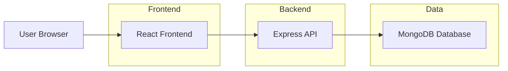

# DigiMart ECommerce Architecture

```mermaid
flowchart LR
    U[User Browser] --> F[React Frontend]
    F --> API[Express API]
    API --> M[MongoDB Database]

    subgraph Frontend
      F
    end

    subgraph Backend
      API
    end

    subgraph Data
      M
    end
```

The project is organized as a full-stack Node.js and Express application with a MongoDB-backed data layer, while the frontend is built with React and Vite.
